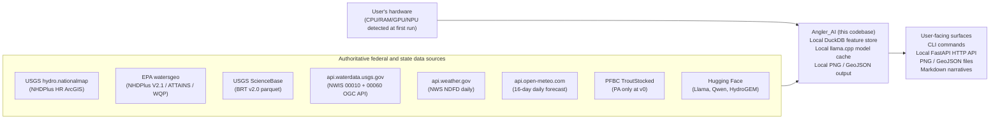
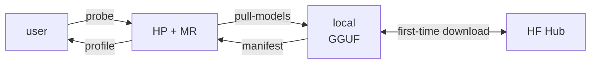
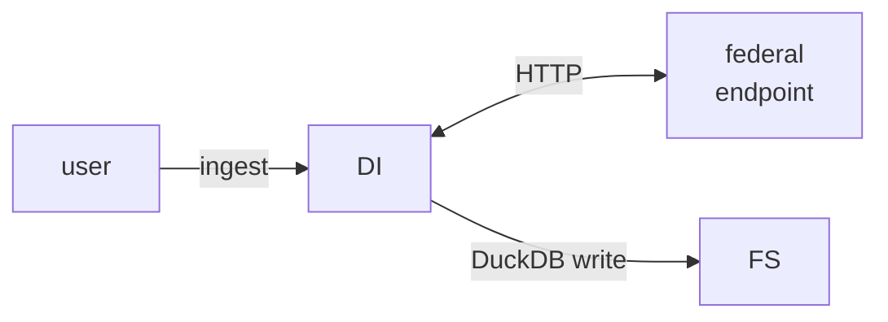
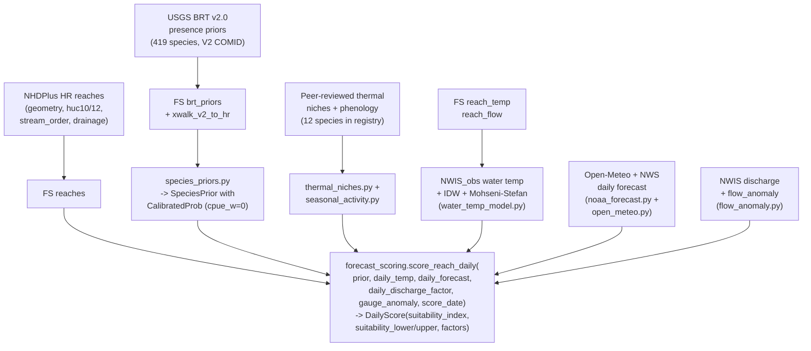
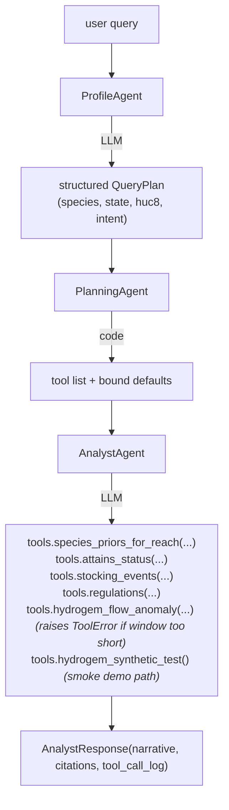

# Angler_AI - Architecture

**Status:** Current as of 2026-06-18 (post Multi-AI review + per-day output + observation-anchored Mohseni-Stefan).
**Audience:** Engineers and AI agents working on the codebase. Read this first.
**Companion docs:**
- `README.md` - top-level overview, quick start, milestone checklist
- `CLAUDE.md` - repository layout, conventions, working commands
- `docs/v0_design.md` - original design-of-record (2026-06-17; some sections now stale; kept as the historical design rationale)
- `docs/forecast_analysis.md` - methodology of the forecast pipeline (sources, math, honest limits)
- `.ai-reviews/multi_ai_review_2026-06-17.md` - peer-review findings + Tier 1 fixes status
- `docs/REQUIREMENTS.md` - FR/NFR/DR/CR with stable IDs (requirements)
- `docs/SUCCESS_CRITERIA.md` - per-milestone release gates + per-use-case acceptance scripts (verification)
- `docs/VISION.md` - what the tool is FOR; the problem, the angler, the product pillars
- `tasks/todo.md` - open punch list (Tier 2/3/4 multi-AI items + v1 deferrals)
- `tasks/lessons.md` - self-improvement loop (lessons-learned with behavioral rules)
- `VIBE_HISTORY.md` - chronological log of milestones and decisions

---

## 0. TL;DR

Angler_AI is a local-first, hardware-adaptive tool that turns federal hydrography + USGS species distributions + peer-reviewed thermal biology + real-time NOAA weather + observed water temperature into **per-day, per-reach relative suitability index maps** for US rivers and streams. The output is a ranking in [0, 1], **not** a calibrated catch probability. It runs entirely on the user's machine; the LLM (llama.cpp) is used only for narrative summarization, never for the underlying math.

The system is organized as ten components (HP, IL, MR, DI, FS, PL, CL, RL, EL, UI) with hard structural invariants:
- All probabilities flow through `CalibratedProbability` with a 95% interval that no surface can strip (FR-6.4).
- Every factor in the scoring chain carries a source tag; missing data returns `factor=1.0` tagged `not_modeled:<reason>` rather than fabricating a value.
- The Charbonneau hyperstability constant is recorded on every reach but explicitly NOT applied to the BRT path at v0 (`cpue_weight=0`) - applying it would be a statistical category error.
- Sensitive-species disclosure is a hard gate, enforced before any reach-level output.

---

## 1. System context



There is **no SaaS dependency** at v0. The only outbound network calls are to public data APIs at ingest time and to Hugging Face for first-time model downloads. Once ingested, the tool runs fully offline (NFR-4.5).

---

## 2. The ten architectural components

| ID | Component | Code root | Responsibility |
|---|---|---|---|
| HP | Hardware Probe | `src/angler_ai/hardware/` | Detect CPU microarch, RAM, GPU vendor + VRAM + CUDA runtime, NPU. Produce `HardwareProfile`. |
| IL | Inference Layer | `src/angler_ai/inference/` | Wrap llama.cpp via llama-cpp-python. Load chosen GGUF on the chosen backend. Serve OpenAI-compatible HTTP API. |
| MR | Model Registry & Router | `src/angler_ai/registry/` | Catalog of available GGUF models per problem set. VRAM-aware router picks model + quant. License surfacing at download time. |
| DI | Data Ingestion | `src/angler_ai/ingest/` | Per-source modules that pull from authoritative endpoints into the feature store. Idempotent. Honest source tagging. |
| FS | Feature Store | `src/angler_ai/features/` | DuckDB schema + connection lifecycle. All reach-level joins anchor on NHDPlus HR COMID. |
| PL | Prediction Layer | `src/angler_ai/prediction/` | The math. Species priors, water-temperature modeling, thermal niches, seasonal phenology, flow anomalies, 5-factor suitability scoring, PNG rendering, GeoJSON export. |
| CL | Calibration Layer | `src/angler_ai/calibration/` | `CalibratedProbability` with structurally-enforced 95% interval. `HyperstabilityConstant` provenance. Wilson-style interval derivation. |
| RL | Reasoning Layer | `src/angler_ai/reasoning/` | MARSHA-style 3-agent pipeline (Profile -> Planning -> Analyst). Narrative generation for the forecast pipeline. |
| EL | Ethics Layer | `src/angler_ai/ethics/` | Sensitive-species suppression policy. Hard gate consulted before every reach-level output surface. |
| UI | User Interfaces | `src/angler_ai/cli.py` + `src/angler_ai/ui/` | Typer CLI. FastAPI HTTP. Output paths to PNG / GeoJSON / Markdown. |

Each component is independently testable and has a stable interface. Inter-component dependencies are documented in section 5.

---

## 3. End-to-end data flow

### 3.1 Setup (one-time per machine)



CLI command flow:
```
angler-ai probe
   -> hardware.probe.probe() returns HardwareProfile
   -> hardware.backend.select_backend(profile) returns chosen llama.cpp wheel index
angler-ai pull-models --profile auto
   -> registry.router selects (model, quant) for VRAM budget
   -> registry.downloader.download() pulls GGUF from HF Hub
   -> manifest entry written
```

### 3.2 Ingest (per HUC8, per source)



CLI command flow:
```
angler-ai ingest --source nhdplus --state ID --huc8 17040203
   -> ingest.dispatch.run() picks the IngestionModule
   -> NHDPlusHRIngest.ingest() queries ArcGIS REST, paginates,
       bulk-inserts into reaches table via PyArrow register + INSERT...SELECT
   -> data_manifest.json updated with source_id, license, row count
```

The dispatcher writes a per-source `IngestSummary` to `data_manifest.json` per DR-2.4. Every persisted row carries `source` (DR-2.1), `ingested_at` (DR-2.2), and predictions carry `model_id` + `model_version` (DR-2.3).

### 3.3 Per-day suitability index (per water, per species)

This is the highest-value path and the one most users care about.



Driver wraps the above for ALL days in the forecast window:

```
.venv/run_western_forecasts.py
   for water in WATERS:
       fetch_centroid_NWS()
       fetch_centroid_OpenMeteo()
       sample_per_huc12_NWS()
       ingest_NWIS_water_temp_for_HUC8 (skip if cached)
       ingest_NWIS_discharge_for_HUC8 (skip if cached)
       compute_discharge_summary_per_gauge() -> flow factor
       detect_HUC8_anomalies() -> per-gauge z-score
       map_reach_to_nearest_gauge() -> per-reach anomaly
       for species in species_list:
           species_priors_for_geometry(huc8) -> list[SpeciesPrior]
           project_daily_temps(comids, daily_air_high, huc8) -> {(comid,date): ProjectedDailyTemp}
           for sp, geom_wkt in priors:
               scores_list = score_reach_over_window(sp, per_day_temps, ...)
               for ds in scores_list:
                   per_day_lists[ds.score_date].append(ScoredReach)
               summary_scored.append(best_day)
           render summary.png
           for date in per_day_lists:
               render daily/<date>.png
           build DayFactorSummary for best + worst day
           generate_narrative(LLM, best/worst day + niche bounds)
```

### 3.4 Natural-language query (`angler-ai ask`)

This path uses the LLM for reasoning, not the forecast pipeline:



Every tool either returns a real value or raises `ToolError`. The Analyst surfaces the error in the response rather than fabricating.

---

## 4. The 5-factor suitability index (the math)

The single most important algorithm in the codebase. Lives in `src/angler_ai/prediction/forecast_scoring.py`.

```
suitability_index(reach, day) = CLAMP_[0,1](
    base_p
    * thermal_factor
    * flow_factor
    * seasonal_factor
    * anomaly_factor
)

suitability_lower / upper are computed by the SAME chain applied to
prior.probability.lower / prior.probability.upper (FR-6.4 interval
propagation).
```

### 4.1 `base_p` - USGS BRT v2.0 calibrated presence prior

- **Source:** Yu et al. 2023, USGS DOI 10.5066/P1UV25FW. 419 native fluvial species, ~270k V2.1 COMIDs, Boosted Regression Tree fit against landscape + EROM covariates.
- **Where:** `prediction/species_priors.py` -> `species_priors_for_reach` / `species_priors_for_geometry`.
- **Calibration:** raw BRT predict_prob wrapped in `CalibratedProbability` with a Wilson-derived 95% interval. The interval is widened for `huc10_proximity` V2-to-HR joins (effective N=50) vs `reachcode_exact` (effective N=200).
- **Hyperstability at v0:** `BRT_CPUE_DERIVED_WEIGHT = 0.0`. The Charbonneau 2025 constant (beta=0.23) is recorded on `CalibratedProbability.hyperstability_beta_applied` but the correction is NOT applied. Source tag in `basis.sources` is `hyperstability:not_applied(reason=BRT_presence_probability_v0)`. This is structural per multi-AI review STAT-01; do not re-enable.

### 4.2 `thermal_factor` - species-niche bell at per-day water temp

- **Niche source:** `prediction/thermal_niches.py`. Peer-reviewed (T_optimum, T_preferred_upper, T_lethal_upper, T_preferred_lower) for 12 species: Elliott 1994 (brown), Wehrly 2007 (brook), Bear 2007 (cutthroat), Selong 2001 (bull), Brinkman 2013 (mountain whitefish), Hubert 1985 / Lamothe 2003 (arctic grayling), Myrick 2000 (rainbow), Wismer 1987 (smallmouth), Casselman 1996 (northern pike), Stewart 1983 (lake trout).
- **Functional form:** symmetric Gaussian anchored on T_optimum, sigma fit so suitability ~= 0.5 at the preferred upper bound. Clamped to [0.01, 1.0] (never zero - the BRT prior already encodes presence probability and a zero would overpower it). Multi-AI review FB-1 / PV-9 flagged the symmetric form as a known limitation; asymmetric warm-tail is a Tier 3 fix.
- **Water temperature source priority** (see section 6):
  1. `NWIS_obs` (real gauge measurement at the reach on that date)
  2. `EcoSHEDS_TEMP` (v1, not loaded)
  3. `NorWeST` (v1, not loaded)
  4. `PG-GNN` (v1, not loaded)
  5. `NWIS_interp` (pure IDW within HUC10, +-1 stream order)
  6. `NWIS_interp_air_adjusted` (IDW anchor + per-day Mohseni-Stefan delta)
  7. `NWIS_air_projected` (pure Mohseni-Stefan from forecast air temp)
- **Fallback:** if niche missing OR temperature unmodeled, `thermal_factor = 1.0` with source `not_modeled:no_niche` or `not_modeled:no_temperature`.

### 4.3 `flow_factor` - discharge regime modifier

- **Primary source:** real NWIS discharge ratio. `ingest/nwis_discharge.py` pulls parameter 00060 for every gauge in the HUC8 over a 30-day window. `discharge_summary_per_gauge` computes per-gauge `recent_7d_mean / 30d_baseline_median`. `discharge_flow_factor(ratio)` maps the ratio to a factor in [0.5, 1.0]:
  - `[0.8, 1.3]` -> 1.0 (typical)
  - `< 0.5` -> 0.7 (very low)
  - `> 2.0` -> 0.5 (turbid, high water)
  - linear interpolation between break points
- **Fallback:** if discharge unavailable, use 3-bin precip-probability proxy from NWS/Open-Meteo (`flow_factor_from_forecast`):
  - precip_prob <= 30% -> 1.0
  - 30-70% -> 0.85
  - > 70% -> 0.6
- **Honest limit:** the precip-probability proxy is **inverted** for snowmelt-dominated June rivers (Big Hole, Madison, Henrys Fork, Jefferson) - hot dry days are the snowmelt peak (turbid) yet score 1.0. Multi-AI review PV-11 flagged; Tier 3 fix substitutes air-temperature-anomaly proxy for snowmelt HUC8s.

### 4.4 `seasonal_factor` - species monthly activity from published phenology

- **Source:** `prediction/seasonal_activity.py`. Per-species 12-element monthly multiplier array. Spawning months attenuated (0.5-0.7), peak post-spawn feeding boosted (1.05-1.10), normal months 1.0. Citations per species (Elliott, Bear, Selong, Wehrly, Lamothe, Brinkman, Wismer, Casselman, Stewart, Myrick).
- **Cap:** **clamped at 1.0 in the scoring chain** so the multiplicative product cannot exceed 1.0. If the raw monthly value > 1.0, the `seasonal_source` tag records `capped_from_1.10` (multi-AI review STAT-03 fix).
- **Fallback:** if species missing from registry, factor=1.0 tagged `not_modeled:no_phenology`.

### 4.5 `anomaly_factor` - flow-condition z-score attenuation

- **Source:** `prediction/flow_anomaly.py`. For each gauge in HUC8, compute z = (recent_7d_mean - baseline_30d_mean) / baseline_30d_sd. Flag `|z| >= 2`. Map reaches to nearest flagged gauge.
- **Factor:** `anomaly_factor(z)` returns:
  - `|z| < 2` -> 1.0 (normal)
  - `|z| in [2, 4]` -> linear from 1.0 to 0.7 (saturating attenuation)
- **NOT HydroGEM:** the production HydroGEM TCN-Transformer in `prediction/hydrogem.py` is loaded for the `ask` reasoning agent (576-hour fixed-window 12-channel input). The forecast pipeline uses the simpler statistical z-score detector; honest about the substitution.
- **Fallback:** no discharge data -> 1.0 tagged `not_modeled:no_anomaly_data`.

### 4.6 Interval propagation (FR-6.4)

Each factor is deterministic (a fixed number for the given inputs). The multiplicative chain applied to the point estimate is identical to the chain applied to the lower and upper bounds:

```python
factor_product = thermal_f * flow_f * seasonal_f * anom_f
suitability_index = clamp(cp.point * factor_product)
suitability_lower = clamp(cp.lower * factor_product)
suitability_upper = clamp(cp.upper * factor_product)
```

Order is preserved by construction (lower <= point <= upper of the CalibratedProbability) and re-asserted after clamp to guard against clamp-induced inversion at the [0, 1] boundary. This is enforced by `tests/test_forecast_scoring.py::test_interval_propagated_through_factor_chain`.

---

## 5. Component contracts (interfaces and dependencies)

### 5.1 HP (Hardware Probe)

- **Public surface:** `from angler_ai.hardware import probe; profile = probe()`
- **Returns:** `HardwareProfile` dataclass: `cpu` (arch, microarch, features, cores), `ram` (total_gb, available_gb), `gpus` (list of `GPUDevice` with vendor, vram, compute_capability, cuda_version, unified_memory), `os`, `python`.
- **Method:** `archspec.cpu.host()` for CPU. `pynvml` for NVIDIA GPUs. `ctypes.WinDLL` probe for installed CUDA runtime. macOS Metal detection via system_profiler. Linux ROCm via rocm-smi.
- **Backend selection:** `hardware.backend.select_backend(profile) -> BackendChoice` picks the llama.cpp wheel index variant from CPU / CUDA cu118 / cu121 / cu122 / cu123 / cu124 / cu125 / cu130 / cu132 / Metal / Vulkan.
- **Dependencies:** none on other Angler_AI components.

### 5.2 IL (Inference Layer)

- **Public surface:** `InferenceRuntime().ensure_loaded(model, quant, path, n_ctx) -> LoadedModel`; `LoadedModel.handle` is a `llama_cpp.Llama`.
- **`serve()`:** wraps llama-cpp-python in a FastAPI server with OpenAI-compatible `/v1/chat/completions`.
- **CUDA DLL handling:** `_add_cuda_dll_directories()` calls `os.add_dll_directory` AND prepends to `PATH` for Windows CUDA 13.x where DLLs live in `bin\x64\` (not `bin\`).
- **Dependencies:** HP (for backend choice), MR (for model entries).

### 5.3 MR (Model Registry & Router)

- **Catalog:** `registry/catalog.yaml` lists ModelEntry per problem set with QuantVariant options (VRAM requirement, license).
- **Router:** `_select_default_text_model(catalog, vram_mb)` picks a default text model for the VRAM tier:
  - < 6 GB: Llama 3.2 3B Instruct Q4_K_M
  - 6-12 GB: Qwen3.5 9B / 4B Q4_K_M
  - 12-20 GB: Qwen3.5 35B A3B IQ2_M
  - 20-32 GB: Qwen3.5 35B A3B Q4_K_XL
  - > 32 GB: Qwen3.5 122B A10B IQ2_XXS
- **Downloader:** `registry.downloader.download(model, quant, models_dir, license_acknowledged=True)`. Surfaces license at acquisition time per CR-3.1.
- **Manifest:** every successful download writes to `manifest.json` so `angler-ai status` knows what's installed.
- **Dependencies:** HP (VRAM budget).

### 5.4 DI (Data Ingestion)

All modules implement `IngestionModule` protocol from `ingest/base.py`:

```python
class IngestionModule(Protocol):
    metadata: SourceMetadata    # source_id, display_name, license, refresh_cadence, source_url
    def ingest(self, store: FeatureStore, **kwargs: object) -> int: ...
    def last_ingested_at(self, store: FeatureStore) -> str | None: ...
```

Dispatcher (`ingest/dispatch.py`) ordered to populate foundational tables first:

| Order | Source ID | Module | Populates |
|---|---|---|---|
| 1 | `nhdplus` | `NHDPlusHRIngest` | `reaches` |
| 2 | `v2_xwalk` | `NHDPlusV2HRXwalkIngest` | `xwalk_v2_to_hr` |
| 3 | `brt` | `USGSBRTFluvialFishIngest` | `brt_priors`, `brt_species` |
| 4 | `attains` | `EPAATTAINSIngest` | `attains_status` |
| 5 | `nwis` | `USGSNWISIngest` | `reach_flow` (state-wide) |
| 6 | `wqp` | `EPAWaterQualityPortalIngest` | `reach_wq` |
| 7 | `pa_pfbc` | `PAPFBCTroutStockedIngest` | `stocking_events` (PA only) |

Forecast-pipeline-scoped ingest modules called from the driver, not the dispatcher:
- `nwis_water_temp.ingest_water_temp_for_huc8` -> `reach_temperature` with source `NWIS_obs`
- `nwis_discharge.ingest_discharge_for_huc8` -> `reach_flow` per HUC8
- `noaa_forecast.fetch_daily_forecast(lat, lon, days)` -> `list[DailyForecast]` (not persisted)
- `open_meteo.fetch_daily_forecast(lat, lon, days)` -> `list[OpenMeteoDaily]` (not persisted)

Rate limiting / backoff: `nwis_water_temp._get_with_backoff` retries 429 with exponential backoff capped at 30 s; max 3 retries. `time.sleep(0.4)` politeness pause between per-gauge calls.

### 5.5 FS (Feature Store)

DuckDB embedded database at `paths.feature_store` (default `%LOCALAPPDATA%\angler_ai\features.duckdb`). Schema at `src/angler_ai/features/schema.sql` (14 tables):

- `reaches` - NHDPlus HR geometry + metadata, PRIMARY KEY comid
- `xwalk_v2_to_hr` - V2 COMID <-> HR COMID crosswalk (1:N) with confidence and method
- `xwalk_necd_to_hr` - EcoSHEDS NECD ID <-> HR COMID (v1)
- `reach_temperature` - water temperature per (comid, date, source)
- `reach_flow` - discharge per (gauge_id, ts)
- `reach_wq` - EPA WQP samples
- `attains_status` - EPA ATTAINS impaired-waters by COMID
- `brt_priors` - USGS BRT v2.0 species presence probability per (V2 COMID, species)
- `brt_species` - species metadata (scientific_name, common_name, prevalence)
- `stocking_events` - state stocking by (state, event_date, species)
- `regulations` - state fishing regs
- `sensitive_species` - CR-1 suppression policy seed
- `tribal_mask` - CR-2 redirect geometries
- `model_selection_log` - NFR-6.2 append-only
- `calibration_log` - NFR-6.3 append-only

The spatial extension is auto-installed and loaded on `store.initialize_schema()`. All reach geometry queries use `ST_*` functions.

PyArrow `register()` + `INSERT...SELECT` is the canonical bulk-insert path (~800x faster than `executemany` for the 112M-row BRT load). See `ingest/_bulk.py`.

### 5.6 PL (Prediction Layer)

The largest component. Subdivided:

| Module | Role |
|---|---|
| `brt_priors.py` | Raw BRT row lookup (rarely called directly; species_priors.py is the canonical interface) |
| `species_priors.py` | `species_priors_for_reach` / `species_priors_for_geometry` -> calibrated `SpeciesPrior` |
| `water_temp_model.py` | `project_daily_temps` -> `{(comid, date): ProjectedDailyTemp}` with priority chain |
| `temperature.py` | `resolve` / `resolve_many` - reach-level temperature picker that honors source priority |
| `thermal_niches.py` | 12-species published thermal preference curves + Gaussian bell |
| `seasonal_activity.py` | 12-species published monthly activity multipliers |
| `flow_anomaly.py` | Statistical z-score anomaly detector + reach-to-gauge mapping |
| `forecast_scoring.py` | `score_reach_daily` / `score_reach_over_window` / `max_score_over_window` -> `DailyScore` |
| `map_render.py` | matplotlib + RdYlGn PNG renderer with colorbar + caption |
| `map_export.py` | GeoJSON FeatureCollection writer for QGIS / Felt / kepler.gl |
| `hydrogem.py` + `hydrogem_arch.py` | TCN-Transformer anomaly detector for the `ask` agent |
| `ssn2.py` | v1; raises NotImplementedError with stable signature |
| `pg_gnn.py` | v1; raises NotImplementedError with stable signature |
| `stan_hurdle.py` | v1; raises NotImplementedError with stable signature |

### 5.7 CL (Calibration Layer)

Three files. **Critical** to understand the invariants here.

- **`types.py`** - `CalibratedProbability(point, lower, upper, interval_confidence, raw_point, hyperstability_beta_applied, basis)`. `__post_init__` validates `0 <= lower <= point <= upper <= 1`. `ProbabilityBasis(cpue_derived_weight, fisheries_independent_weight, sources)`. Both frozen dataclasses with `slots=True`. **No surface may construct a probability outside this type.** FR-6.4 enforcement.
- **`hyperstability.py`** - `HyperstabilityConstant(beta, source, geography, standard_error)`. `CHARBONNEAU_2025_BC_STEELHEAD = HyperstabilityConstant(beta=0.23, ...)`. `apply_hyperstability(raw_p, cpue_weight, constant)` blends `p^(1/beta)` with raw by `cpue_weight`. At v0 the BRT path passes `cpue_weight=0`, so the function returns `raw_p` unchanged - this is intentional and documented in `species_priors.BRT_CPUE_DERIVED_WEIGHT`.
- **`intervals.py`** - `naive_beta_interval(point, n_effective, confidence)` returns Wilson-approximation lower/upper. Multi-AI review STAT-04 flagged the docstring mismatch (it implements Wilson but is named for Beta); Tier 4 rename pending.

### 5.8 RL (Reasoning Layer)

- **`agents.py`** - `LLMRunner` adapter around llama-cpp-python. `ProfileAgent` (LLM, parses NL query to `QueryPlan`). `PlanningAgent` (code, picks tools). `AnalystAgent` (LLM, calls tools, writes narrative).
- **`tools.py`** - 8 tool functions for the Analyst. Each queries real DuckDB tables. Missing data raises `ToolError`; the Analyst surfaces the error rather than fabricating. Tools: `species_priors_for_reach`, `reach_temperature`, `attains_status`, `stocking_events`, `regulations`, `hydrogem_flow_anomaly`, `hydrogem_synthetic_test`, `sensitive_species_check`.
- **`forecast_narrative.py`** - separate from the 3-agent pipeline. `generate_narrative(LLM, NarrativeRequest)` produces a 6-9 sentence summary for one (water, species), grounded in pre-computed `DayFactorSummary` for best and worst days. System prompt requires explicit naming of best/worst date + WHY explanation citing factor differences. Tier 2 multi-AI review item is an automated faithfulness check that diffs the narrative against the FactorBreakdown JSON; not yet implemented.

### 5.9 EL (Ethics Layer)

- **`policy.py`** - `apply_ethics(reach_predictions)` consults `sensitive_species` table and `tribal_mask`, coarse-grains output per row per CR-1.1 / CR-1.2 / CR-2.3.
- **`sensitive_species.py`** - loader that seeds the `sensitive_species` DuckDB table from `data/sensitive_species_seed.csv` on first run.
- **`data/sensitive_species_seed.csv`** - editable seed. As of 2026-06-18: bull trout, Apache trout, Gila trout, Paiute cutthroat, Lahontan cutthroat at HUC-10 per CR-1.1. Greenback, Rio Grande, Westslope, Yellowstone, Bonneville, Colorado River cutthroats at HUC-12 per CR-1.2.
- **`tribal_mask.py`** - reach masking with redirect URL to the tribe's own data resources. Public USGS / state tribal-boundary datasets only (CR-2.3); no CRITFC or other tribally-managed-data scraping.

The Ethics Layer is consulted before every reach-level output surface: `species` CLI, `map` CLI, `forecast` CLI, `ask` Analyst, GeoJSON export. **Never bypass.**

### 5.10 UI (User Interfaces)

- **`cli.py`** - Typer entry point. Commands: `probe`, `pull-models`, `ingest`, `species`, `map`, `forecast`, `ask`, `serve`, `status`.
- **`ui/http_api.py`** - FastAPI app exposing the same commands as HTTP endpoints plus the llama-cpp-python OpenAI-compatible `/v1/chat/completions`.

---

## 6. Source priority hierarchies

### 6.1 Water temperature resolver

`prediction/temperature.py::_PRIORITY` (highest authority first):

```
NWIS_obs                    direct gauge measurement at the reach
EcoSHEDS_TEMP               peer-reviewed model (v1; not loaded)
PG-GNN                      physics-guided GNN nowcast (v1; not loaded)
NWIS_interp                 IDW spatial extrapolation within HUC10 + stream order
NWIS_interp_air_adjusted    IDW anchor + per-day Mohseni-Stefan air-temp delta
                            (2026-06-18 fix; honest temporal trajectory)
not_modeled                 no real source covers this reach
```

When scoring, the resolver picks the highest-priority entry present for the (comid, date) tuple. Missing data returns `not_modeled` (NEVER a substituted value).

**NorWeST is intentionally NOT in the resolver chain** (2026-06-20). NorWeST publishes a 1993-2011 mean-August stream-temperature climatology, not a daily reading; treating it as a current-day temperature source would silently substitute a 30-year mean for what the pipeline thinks is daily data. Instead NorWeST feeds `water_temp_model.py::project_daily_temps` as the per-reach `T_water_baseline` anchor for the Mohseni-Stefan projection - replacing the stratified `default_small_headwater` / `default_medium_stream` / `default_mainstem` defaults whenever a NorWeST row exists. The source tag on the resulting `ProjectedDailyTemp` becomes `NWIS_interp_air_adjusted_norwest_anchor` (IDW spatial + NorWeST baseline) or `NWIS_air_projected_norwest_anchor` (NorWeST baseline + Mohseni delta, no IDW available) - both surface the NorWeST contribution to the caller honestly.

The NorWeST shapefile is manually downloaded once per processing unit from research.fs.usda.gov/rmrs/projects/norwest and placed under `${data_dir}/raw/norwest/<PU_name>/`. The `reach_temp_baseline` table holds the (comid, month, baseline_temp_c) tuples, keyed by HR COMID via `xwalk_v2_to_hr`.

### 6.1.x Species prior fallback chain (non-native species)

`prediction/species_priors.py::species_priors_for_geometry` is a router:

```
USGS_BRT_V2.0 native-range prior   prevalence-scaled Wilson interval
                                   (interval_kind='sampling', width ~0.05-0.10)
USGS_NAS_V1.0 presence-only        NAS occurrence in HUC8 -> wide flat prior
                                   point=0.35, [0.05, 0.65]
                                   (interval_kind='spatial_unmodeled', width 0.30)
empty list                         no BRT row + no NAS row; caller surfaces
                                   "no priors" honestly (e.g., the v0
                                   Colorado run skipped rainbow + brook
                                   before NAS was wired)
```

The fallback is a Python-level router, not a SQL UNION: BRT's `sampling` and NAS's `spatial_unmodeled` interval semantics are categorically different and must never blend in a single output tuple. `ProbabilityBasis.interval_kind` carries the semantic to the caption renderer + narrative + JSON so a brown-trout-vs-rainbow side-by-side map reads correctly.

### 6.2 Daily forecast (air + precip)

`ingest/noaa_forecast.py` + `ingest/open_meteo.py`:

```
NWS_NDFD_daily              api.weather.gov NDFD daily forecast (days 0-7)
OpenMeteo_daily             api.open-meteo.com 16-day daily forecast (days 8-16)
persistence_projection      legacy tag from M7; no longer emitted since Open-Meteo
                            covers the days-8-16 window with real forecasts
```

The driver merges by date: NWS_NDFD_daily wins for any date it covers; Open-Meteo fills the gap.

### 6.3 Flow factor

```
NWIS discharge ratio        recent_7d_mean / 30d_baseline_median (real data)
precip-probability proxy    NWS+Open-Meteo precipitation probability (fallback)
not_modeled                 no discharge data, no forecast
```

### 6.4 Anomaly factor

```
flow_z_anomaly              statistical z-score on recent vs baseline gauge discharge
not_modeled                 no discharge data
```

HydroGEM is loaded in the codebase (`prediction/hydrogem.py`) but only callable from the `ask` Analyst, not from the forecast pipeline. The forecast pipeline uses the simpler `flow_anomaly.py` z-score detector with honest tagging that says so.

---

## 7. Cross-cutting concerns

### 7.1 Source tagging (DR-2.1)

Every persisted row carries a `source` column. Every per-factor value in `FactorBreakdown` carries a `*_source` string. Source strings are documented in code; canonical prefixes include:
- `USGS_BRT_V2.0`, `NHDPlusV2.1_xwalk:reachcode_exact`, `NHDPlusV2.1_xwalk:huc10_proximity`
- `hyperstability:not_applied(reason=...)`, `hyperstability:<citation>`
- `niche:<scientific_name> x temp:<temp_source>`, `not_modeled:no_niche`, `not_modeled:no_temperature`
- `NWS_NDFD_daily`, `OpenMeteo_daily`, `not_modeled`
- `discharge_ratio:typical`, `discharge_ratio:low`, `discharge_ratio:very_low`, `discharge_ratio:high`, `discharge_ratio:very_high`, `not_modeled:no_discharge_data`
- `phenology:<scientific_name>`, `phenology:<scientific_name>|capped_from_<X.XX>`, `not_modeled:no_phenology`
- `flow_z_anomaly:normal`, `flow_z_anomaly:|z|=<X.XX>`, `not_modeled:no_anomaly_data`

Multi-AI review SI-11 suggests promoting these to `Literal[...]` / StrEnum at type-check time; Tier 4 pending.

### 7.2 No fabricated values (project-level rule)

Encoded in `CLAUDE.md` conventions and tested in `tests/test_temperature_resolver.py::test_resolver_never_returns_proxy_source`. The rule is the user-codified "no fake, stub, BS stuff" hard invariant from M5. It applies everywhere:
- Missing data -> `not_modeled:<reason>` with `factor=1.0`, never a substituted value
- v1 stubs raise `NotImplementedError` rather than returning placeholders
- LLM narratives use the deterministic FactorBreakdown JSON as ground truth and are prompted to flag missing factors explicitly

### 7.3 Calibration interval propagation (FR-6.4)

Architectural invariant enforced by:
1. `CalibratedProbability` `__post_init__` validation (cannot construct an inconsistent interval)
2. `DailyScore.suitability_lower / upper` fields propagated through the multiplicative chain
3. `tests/test_forecast_scoring.py::test_interval_propagated_through_factor_chain` regression test

Tier 4 pending: store `score_interval: tuple[float, float]` on every map export tile and surface in narratives.

### 7.4 Ethics gate (CR-1, CR-2)

`apply_ethics()` is the only function that touches reach-level output and it is called before every output surface. Tested in `tests/test_ethics_policy.py`. Sensitive-species seed at `src/angler_ai/ethics/data/sensitive_species_seed.csv` is the editable policy table.

### 7.5 Hardware-adaptive model selection

Two layers:
1. **Backend selection** (`hardware/backend.py`): which llama.cpp wheel index variant to use, driven by CPU + GPU + CUDA runtime probe.
2. **Model selection** (`registry/`): which GGUF + quant to load, driven by available VRAM. Default tier table in section 5.3.

Both decisions are logged to `model_selection_log` per NFR-6.2.

### 7.6 Refuted-claim handling (CR-4.5)

Some specific numbers from the deep-research passes were adversarially refuted in pass 2 (e.g., Unsloth Dynamic 2.0 MMLU figures, hf_transfer env-var name). When referencing any such claim in code or docs, include the refutation alongside. The multi-AI review (2026-06-17) is the second-pass adversarial verification for the v0 code; Tier 1 fixes are tracked back to specific finding IDs (STAT-01 through PV-15).

---

## 8. Output structure

### 8.1 Per-day forecast output (the primary user-facing artifact)

```
out/forecasts/
  <water>/                            e.g. Big_Hole, Madison_and_Firehole, Henrys_Fork, Jefferson
    <species>/                        e.g. brown_trout, arctic_grayling, mountain_whitefish
      summary.png                     max-over-window aggregate per reach
      daily/
        2026-06-18.png                one map per day in the 14-16 day forecast window
        2026-06-19.png
        ...
        2026-07-03.png
  narratives.md                       per (water, species): best/worst day with WHY +
                                      a per-day suitability summary table
  run.log                             pipeline run log
```

Each PNG is matplotlib + RdYlGn colormap on [0, 1] with the colorbar label "Relative suitability index (0-1, NOT a probability)". The title surfaces the date and forecast source. The caption surfaces BRT DOI, hyperstability source (not_applied notation), niche citation, forecast sources, water-temp coverage, and anomalous-gauge count.

### 8.2 GeoJSON export (FR-9.3)

`angler-ai map --species X --huc8 Y --out F.geojson` produces a `FeatureCollection` where each `Feature` is one reach with properties:
- `comid`, `probability` (suitability_index), `lower`, `upper` (propagated interval)
- `raw_probability` (BRT raw), `hyperstability_beta_applied`, `basis.sources`
- `v2_join_method`, `temperature_c`, `temperature_source`, `temperature_date`

Plus FeatureCollection-level metadata: model id, version, DOI, hyperstability source, calibration note.

### 8.3 LLM narrative (`narratives.md`)

One section per (water, species). Each section contains:
- 6-9 sentence narrative with explicit BEST DAY and WORST DAY (exact dates), median + top suitability, WHY explanation (mean water temp vs niche bounds, factor changes), and a closing modeling-limit sentence.
- Per-day summary table: date, forecast source, n_reaches, top suitability, median suitability.

---

## 9. Architectural invariants

These are the hard rules. Violating any of them requires an explicit design update.

1. **Local-first.** No outbound network calls except to public data APIs at ingest time and Hugging Face for first-time model downloads.
2. **No fabricated values.** Missing data returns the honest `not_modeled` tag and `factor=1.0`. Never substitute a value.
3. **Calibration interval propagation (FR-6.4).** Every probability is a `CalibratedProbability` with a 95% interval. The interval travels with the point through every factor multiplication. `DailyScore` carries `suitability_lower` and `suitability_upper`.
4. **Hyperstability not_applied at v0 on the BRT path.** `BRT_CPUE_DERIVED_WEIGHT = 0.0`. The constant is recorded for provenance; the correction is not applied. Do not silently re-enable.
5. **suitability_index, not catch_probability.** The 5-factor multiplicative product is a relative ranking in [0, 1], explicitly NOT a calibrated catch probability. All user-facing surfaces use the suitability terminology.
6. **Clamped to [0, 1].** The product is clamped explicitly. `seasonal_factor` is capped at 1.0 with an audit tag (`capped_from_X.XX` in `seasonal_source`).
7. **Ethics gate is a hard gate.** Sensitive-species suppression is consulted before every reach-level output. Bull trout, Apache, Gila, Paiute, Lahontan -> HUC-10. Greenback, Rio Grande, Westslope, Yellowstone, Bonneville, Colorado River -> HUC-12.
8. **Source tag everywhere.** Every persisted row carries `source`; every factor carries `*_source`. No anonymous numbers.
9. **No emojis.** Project-wide rule. Hook-enforced. No exceptions in code, docs, or commit messages.
10. **No SaaS escalation by default.** SaaS frontier-model escalation per query is opt-in (FR-7.4) and must be a per-call user choice, never the default.

---

## 10. Architectural decisions log (link to detail)

| Date | Decision | Where to read |
|---|---|---|
| 2026-06-17 | Six deep-research passes accepted as the v0 substrate. | `research/01..06_*.md` |
| 2026-06-17 | 10-component architecture established. | `docs/v0_design.md` sections 4-5 |
| 2026-06-17 | M1 through M6 milestone definitions. | `docs/v0_design.md` section 7 |
| 2026-06-17 | Tech stack pinned (Python 3.10-3.12, llama.cpp, DuckDB, R for SSN2). | `docs/v0_design.md` section 8 |
| 2026-06-17 | M7 forecast pipeline shipped (3-factor: BRT x thermal x flow). | `VIBE_HISTORY.md` |
| 2026-06-17 | M8 multi-factor closeout (5-factor + Mohseni-Stefan + Open-Meteo + LLM narrative). | `VIBE_HISTORY.md` |
| 2026-06-17 | Multi-AI review: 5 reviewers, 20 high/critical surviving adversarial verification. | `.ai-reviews/multi_ai_review_2026-06-17.md` |
| 2026-06-18 | Tier 1 fixes: suitability_index rename, interval propagation, [0,1] clamp, hyperstability dropped from BRT path, ESA species added. | `VIBE_HISTORY.md` |
| 2026-06-18 | Per-day map output structure; best/worst day narratives with WHY. | `VIBE_HISTORY.md` |
| 2026-06-18 | Observation-anchored Mohseni-Stefan (`NWIS_interp_air_adjusted`). | `VIBE_HISTORY.md` |

---

## 11. What is intentionally NOT in this architecture (v0 boundaries)

These are designed-but-deferred. They have stable interfaces and `NotImplementedError` stubs so v1 can swap in without changing call sites.

- **SSN2 spatial stream-network GLM** (`prediction/ssn2.py`) - the v1 replacement for BRT as the base prior. Will train against observed catch data with stream-network spatial autocorrelation. CalibratedProbability interface holds.
- **PG-GNN** (`prediction/pg_gnn.py`) - physics-guided graph neural network for per-day water temperature and flow nowcasts. Designed to replace the Mohseni-Stefan + IDW + air-adjusted chain when training data and compute are available.
- **NorWeST + EcoSHEDS gridded temperature** (`ingest/norwest.py`, `ingest/ecosheds.py`) - peer-reviewed gridded predictions. Designed to populate `reach_temperature` with model-derived values that beat the v0 IDW + Mohseni stack.
- **Stan hurdle-gamma harvest model** (`prediction/stan_hurdle.py`) - Bayesian per-trip harvest probability. Designed to layer on top of suitability for the "should I keep this fish" use case.
- **ID / MT / WY state stocking + regulations** (`ingest/id_fg.py` and similar) - probe modules for state ArcGIS Hubs; deferred to v1. PA PFBC is the v0 exemplar.
- **HydroGEM in the forecast pipeline** - HydroGEM is loaded and usable via the `ask` Analyst. Wiring it into the per-day forecast pipeline requires the 576-hour 12-channel feature engineering pipeline, deferred to v1.
- **Lakes, reservoirs, ponds.** Rivers and streams only at v0. Pattern overlap exists but is deferred.
- **Saltwater.** Out of scope.
- **Mobile apps.** Server-side / desktop only at v0.
- **On-device fine-tuning, distillation, model merging.** Deferred to v2.
- **Tribally-managed waters as a queryable layer.** CRITFC sovereignty-by-design; redirect-only at v0.
- **Year-round mainstem Eastern trout** where drainage > 200 km^2. EcoSHEDS BTO ceiling; out of scope.
- **Heterogeneous bipartite GNN-SDM.** Architecture exists but efficacy refuted in the research pass; out of scope.
- **Time-series foundation models for hydrology.** TSFMs still lose to domain LSTMs as of 2026; out of scope.

---

## 12. Quick map: "I need to change X, where do I edit?"

| I want to... | Edit |
|---|---|
| Add a new species thermal niche | `prediction/thermal_niches.py` |
| Add a new species phenology | `prediction/seasonal_activity.py` |
| Change how the 5 factors combine | `prediction/forecast_scoring.py::score_reach_daily` |
| Add a new water-temperature source | `prediction/temperature.py::_PRIORITY` + `prediction/water_temp_model.py` + new ingest module |
| Add a new sensitive species | `ethics/data/sensitive_species_seed.csv` (and rebuild the seed table) |
| Tweak the LLM narrative prompt | `reasoning/forecast_narrative.py::_SYSTEM_PROMPT` |
| Change how the map looks | `prediction/map_render.py::render_scored_reaches_png` |
| Change how the BRT prior is calibrated | `prediction/species_priors.py::_calibrate` and `calibration/intervals.py` |
| Change which model the router picks | `registry/router.py` + `registry/catalog.yaml` |
| Re-enable hyperstability (DO NOT without an explicit design update) | `prediction/species_priors.py::BRT_CPUE_DERIVED_WEIGHT` |
| Add a new CLI command | `cli.py` |
| Add a new ingest source | new file in `ingest/` implementing `IngestionModule` + register in `ingest/dispatch.py` |
| Add a new tool for the Analyst | `reasoning/tools.py` + register in `reasoning/agents.py::AnalystAgent.TOOLS` |
| Add a new DuckDB table | `features/schema.sql` |

---

## 13. Running the system end-to-end

```bash
# One-time machine setup
angler-ai probe
angler-ai pull-models --profile auto

# Per HUC8 ingest (idempotent; safe to re-run)
angler-ai ingest --source nhdplus --state ID --huc8 17040203
angler-ai ingest --source v2_xwalk --state ID --huc8 17040203
angler-ai ingest --source brt --state ID

# Per-reach species check
angler-ai species --comid 23002900059404

# GeoJSON map for QGIS / Felt / kepler.gl
angler-ai map --species "brown trout" --huc8 17040203 --out hf.geojson

# Single PNG forecast (best-day-over-window)
angler-ai forecast --species "brown trout" --huc8 17040203 --out hf_brown.png

# Multi-water per-day pipeline (5 western waters, 16 days, 153 PNGs + narrative)
.venv/Scripts/python.exe -u .venv/run_western_forecasts.py
# Environment variables:
#   NARRATE=0    skip LLM narrative generation
#   SKIP_MAPS=1  skip PNG rendering (fast scoring + narrative-only iteration)

# Natural-language reasoning
angler-ai ask "good brown trout fishing on the Henrys Fork next week"
```

For developer iteration:

```bash
pytest -q                              # full 95-test suite
pytest -q tests/test_forecast_scoring.py   # the 5-factor invariants
pytest -m "not network"                # offline-only subset
ruff check src tests
ruff format src tests
mypy src
```
